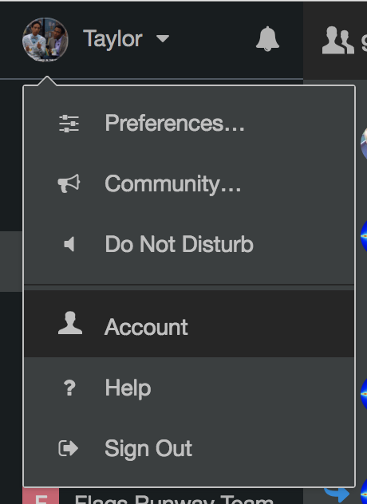

### Flowdock Setup

To post to Flowdock using Drone, you will need to make sure you have the correct token in Flowdock.

##### 1. Go to User > Account in upper-left corner of screen

##### 2. Click on `Developer Applications`
##### 3. Click on `New Application`
##### 4. Enter `Name` (example: "Drone")
##### 5. Select `Shortcut Application` checkbox
##### 6. (Optional) Add `Description`, `Help` and `Icons`
##### 7. Enter `Demo Source` (example: "Drone") and select flow
##### 8. Click `Generate Source`
##### 9. Copy generated token to use in Drone
##### 10. Profit :+1:
